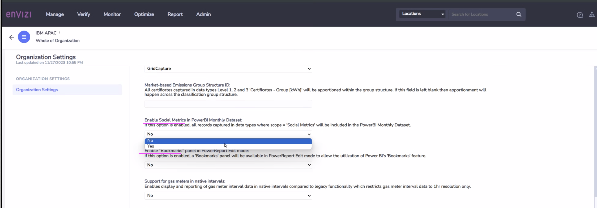
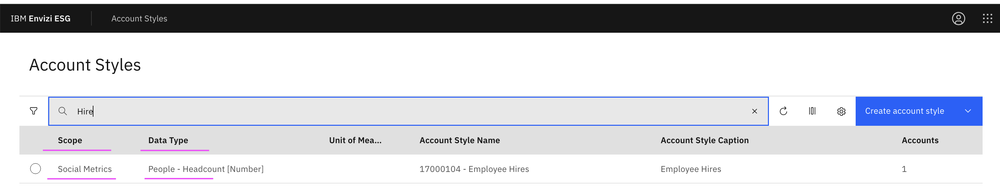
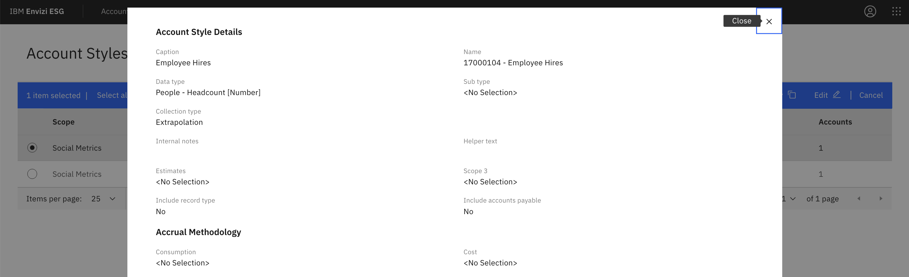
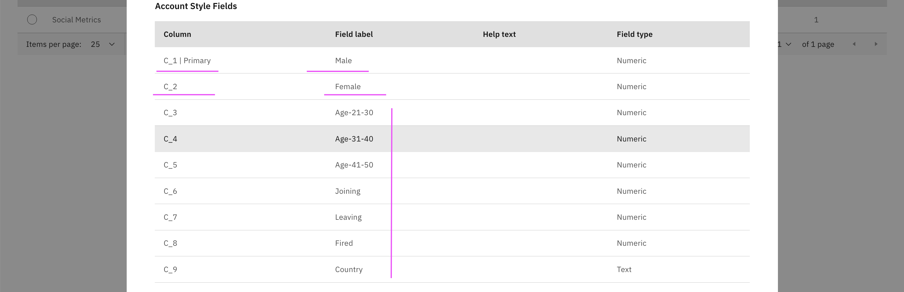
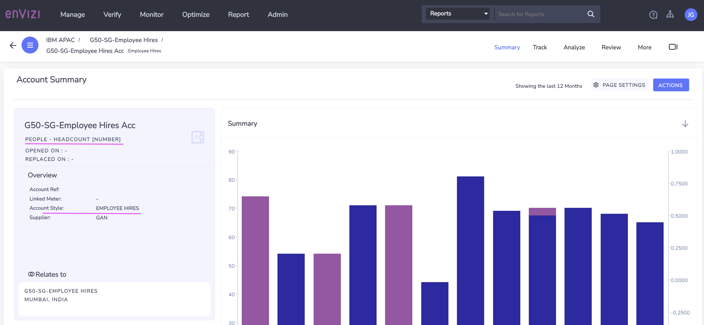
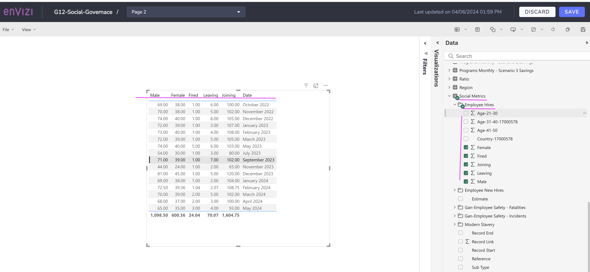

# How to create Social Metrics data into Power Report

## 1. Enable Social Metrics

1. Enable Social metrics in Power BI Report in Organization Settings. This can be done by requesting the Product team.

## 2. Create Account Style

1. Create an account style with the following.

- Scope : Social Metrics
- Data Type : People - Headcount [Number]

2. You can create the required fields in the account style as like in the below picture.

## 3. Create Account

1. Create an account with the above create Account Style.

## 4. Create Power Report

Once the account style is created, wait for day for the daily refresh to happen.

1. You can see the created account style under social metrics menu.

You can create power report as like below.

